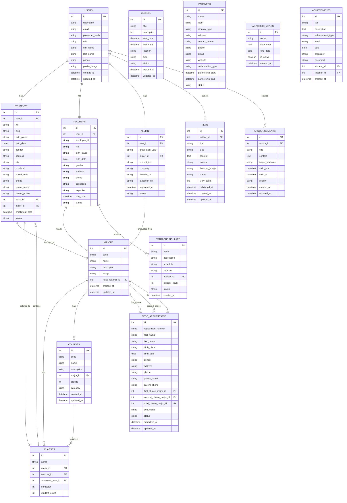

# SMK Negeri Website - Database Design

## Overview

This document outlines the database schema for the SMK Negeri website, covering all entities and relationships required to support the features described in the requirements.

## Entity Relationship Diagram

## Detailed Table Structures

### Users Table

Stores all user accounts for the system with role-based access control.

### Students Table

Contains detailed information about enrolled students including academic and personal data.

### Teachers Table

Stores information about teaching staff including qualifications and expertise.

### Majors Table

Lists all vocational programs offered by the school with descriptions and images.

### Classes Table

Represents academic classes organized by major, year, and semester.

### Courses Table

Contains curriculum information for all courses offered in each major.

### News Table

Stores published articles and news items with metadata for SEO and categorization.

### Announcements Table

Holds important announcements with target audience and validity periods.

### Events Table

Tracks school events, activities, and calendar items.

### Alumni Table

Maintains information about graduates including career paths and contact details.

### PPDB Applications Table

Manages student admission applications with document tracking.

### Partners Table

Catalogs industry partnerships and collaborations with contact information.

### Academic Years Table

Defines academic periods for organizing curriculum and scheduling.

### Extracurriculars Table

Lists student activities and clubs with scheduling information.

### Achievements Table

Records student accomplishments in academics, sports, arts, and other areas.

## Indexing Strategy

- Primary keys on all tables
- Foreign key indexes for relationship navigation
- Composite indexes for frequently queried combinations
- Full-text search indexes for content fields
- Unique constraints on email, username, and identification numbers

## Security Considerations

- Password hashing with bcrypt or similar
- Role-based access control implementation
- Data encryption for sensitive information
- Audit trails for data modifications
- Regular backups and disaster recovery
